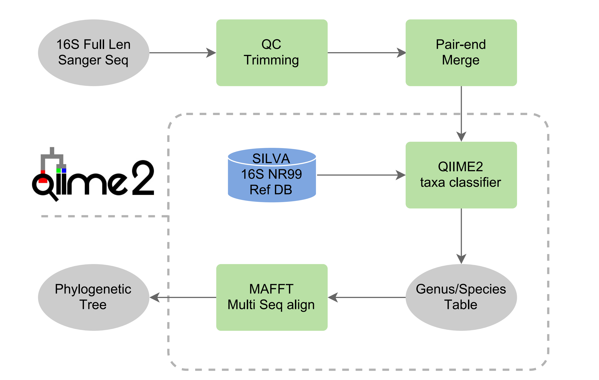

# 16S-Taxa-Phlyo Pipeline
Use 16S Sanger sequencing to identify the taxa of culturomics
This pipeline utilize the feature of QIIME 2



## Usage:

### Request

For basic usage of the sever, please refer to [LD Lab BioInfo Wiki](https://github.com/LD-Lab/LD-Lab-BioInfo-Wiki).

```QIIME2``` environment is already set up at ```/home/LDlab/BioSoft/anaconda3/envs/qiime2-2019.4```.

### Data 

For each strain, 4 sequencing result files should be named as follows. ```.seq``` files are not necessary.

```StrainName__27F__*.ab1```

```StrainName__27F__*.seq```

```StrainName__1492R__*.ab1```

```StrainName__1492R__*.seq```

All the files should have the same and uniqe ```StrainName``` as the prefixion. The forward and reverse sequence should have the ```__***F__``` and ```__***R__``` in the filename respectively. You can also specify the ```StrainName``` with a ```metadata``` file.

All sequence results can be put in one ```path```. For example,

```bash
~/16S-Taxa-Phlyo/S200904-020-371-1
```

### Database

The database ```SILVA 16S NR99 Ref DB``` are saved at ```/home/LDlab/DataBases/TaxaIdentification/classifier```. The database is downloaded from [QIIME2 Doc](https://docs.qiime2.org/2020.8/data-resources/#silva-16s-18s-rrna) as [Silva 138 SSURef NR99 full-length sequences](https://data.qiime2.org/2020.8/common/silva-138-99-seqs.qza) and [Silva 138 SSURef NR99 full-length taxonomy](https://data.qiime2.org/2020.8/common/silva-138-99-tax.qza).

### Pipeline

The one line command would give the ```taxonomy.tsv``` based on the sequencing result. If you already have the 16S sequence as a ```.fasta``` file, you can skip to QIIME2 taxa classifier section below.

#### One line command

The following command will save the result in ```~/16S-Taxa-Phlyo/result``` based on the sequencing result in ```~/16S-Taxa-Phlyo/S200904-020-371-1```.

```bash
conda activate /home/LDlab/BioSoft/anaconda3/envs/qiime2-2019.4
cd ~/16S-Taxa-Phlyo
/home/LDlab/BioSoft/Scripts/16S-Taxa-Phlyo/16S-Taxa-Phylo.sh ./S200904-020-371-1 ./Result
```
The phlyo result is saved as ```taxonomy.tsv``` the evolutionary tree is saved as ```tree.nwk```.

#### Step by step processing

You can also process the data step by step follows below.

#### Step 1: QC Trimming

```bash
conda activate /home/LDlab/BioSoft/anaconda3/envs/qiime2-2019.4 
python /home/LDlab/BioSoft/Scripts/16S-Taxa-Phlyo/seq_quality_trimming.py 
    -i ./S200904-020-371-1 
    -o ./Result
```

#### Step 2: Pair-end Merge

```bash
python /home/LDlab/BioSoft/Scripts/16S-Taxa-Phlyo/processing-merged-seq.py ./Result/merged_seqs.fasta
```

#### Step 3: QIIME2 taxa classifier

If you want to classify the strain by 16S sequence, replace the ```.fasta``` as the input file ```-i *.fasta``` below.

```bash
python /home/LDlab/BioSoft/Scripts/16S-Taxa-Phlyo/16S-Taxa-Phylo-Pipeline.py 
    -i ./Result/mergedSeq_clean.fasta 
    -o ./Result
```
You can also use ```-r reference_reads.qza -t reference_taxonomy.qza``` to specify the database you want to use.

